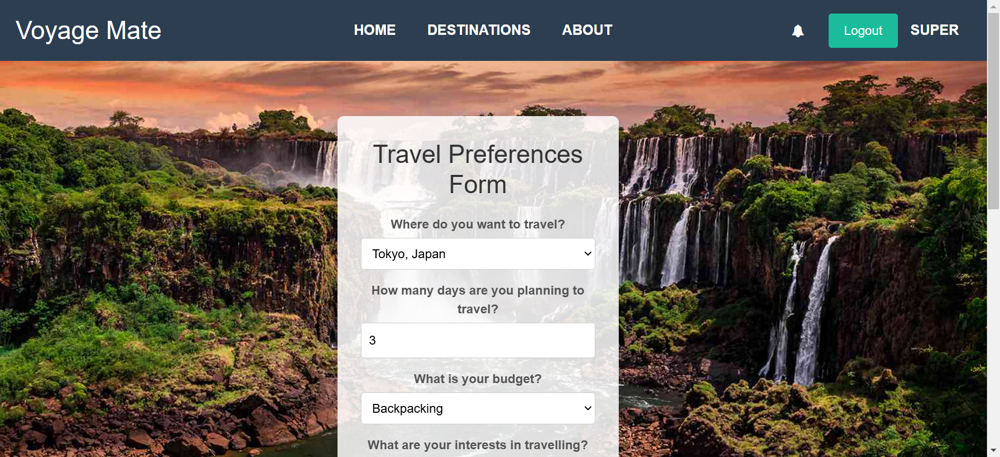
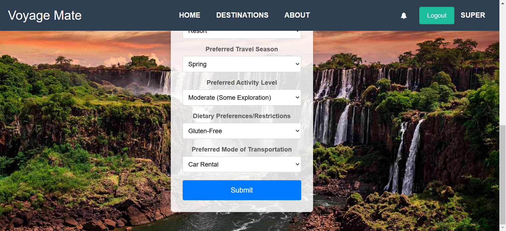
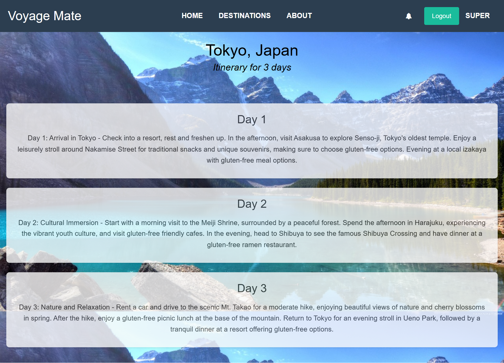
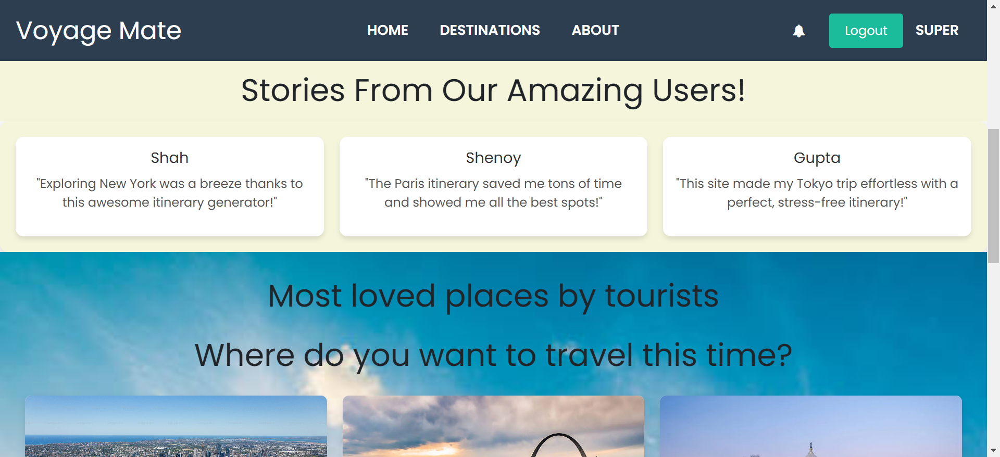
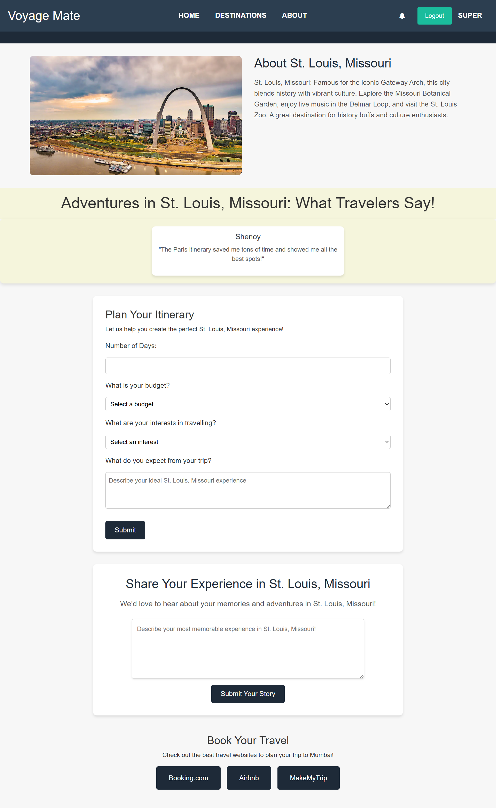

# 🌍 Voyage Mate - Your Ultimate Travel Companion  

Welcome to *Voyage Mate*, a web application created by **Team Byte Force** for the prestigious **Hackathon Argonyx '24**. We are thrilled to participate in this hackathon, which celebrates innovation, creativity, and technical excellence!  

## 🚀 About Voyage Mate  

Voyage Mate is designed to enhance your travel planning experience by making it personalized, interactive, and seamless. Whether you're a solo adventurer, a family explorer, or a group traveler, our app provides:  

- 🌟 **Dynamic Itineraries**: Get customized travel plans based on your preferences.  
- ✨ **User Experiences**: Explore top travel stories and insights shared by others.  
- 🏙️ **Destination Highlights**: Discover popular cities with detailed guides and user experiences.  
- 🔗 **Booking Assistance**: Seamless redirects for travel and accommodation bookings.  
- 📲 **Catchy Pop-ups**: Periodic motivational phrases to inspire your wanderlust and keep you engaged.  
- 🛎️ **Notifications**: Stay updated on interactions and receive personalized travel recommendations.  

## 🌐 Features  

### Homepage  
- **Welcome to the World of Exploration**: A visually captivating landing page encouraging users to start their journey.  
- **Top User Experiences**: Inspirational stories shared by fellow travelers.  
- **Popular Destinations**: Quick access to detailed city guides.  

### Dynamic Itinerary Creation  
- A user-friendly questionnaire helps us understand:  
  - Your travel destination.  
  - Who you’re traveling with.  
  - Your preferred activities.  
- Based on this, an itinerary is dynamically generated using the **OpenAI API**.  

### Destination Pages  
- **Detailed City Insights**: Learn about the culture, landmarks, and activities of popular destinations.  
- **Experience Sharing**: Share your travel stories and inspire others.  
- **Itinerary Generator**: Create a trip plan for the specific city.  
- **Travel & Booking Redirects**: Simplify your trip planning with direct links to trusted booking platforms.  

### User Engagement Features  
- **Catchy Pop-ups**: Enjoy periodic messages that encourage users to explore more and keep the adventure alive.  
- **Notifications**: Get notified about your interactions with the app and receive periodic travel recommendations.  

## 🛠️ Technologies Used  

- **Django** (Backend Framework)  
- **SQLite** (Database)  
- **OpenAI API** (Dynamic Itinerary Generation)  
- **HTML, CSS, JavaScript** (Frontend)  
- **Python** (Core Logic)  

## 📸 Demo  

### Homepage  
  

### Itinerary Questionnaire
  
  

### Dynamic Itinerary Creation  
  

### Stories From Our Users
  

### Destination Page  
  

## 💡 Inspiration  

We were inspired by the growing desire for personalized travel planning and the need to simplify the process while making it engaging and fun.  

## 💻 How It Works  

1. **Start Your Journey**: Click the explore button on the homepage.  
2. **Answer a Few Questions**: Help us tailor your experience by telling us what you love.  
3. **Get Your Itinerary**: Receive a curated plan with activity suggestions, destinations, and booking options.  
4. **Share Your Story**: Contribute to the community by sharing your travel experiences.  
5. **Stay Engaged**: Receive motivational pop-ups and notifications about exciting new recommendations.  

## 🤝 Acknowledgments  

A big thank you to **Hackathon Argonyx '24** for giving us this platform to showcase our creativity and technical skills. We hope Voyage Mate inspires the spirit of adventure in every user!  